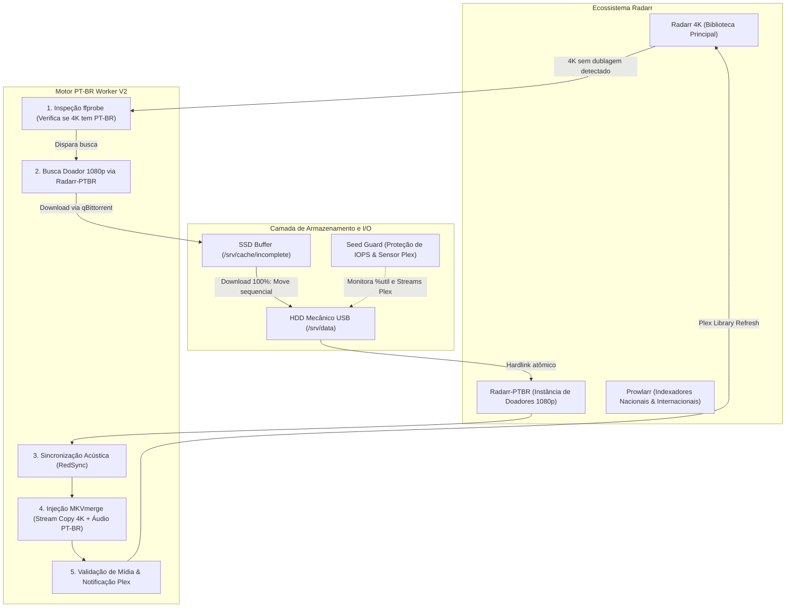

# 🎬 PTBR-Merger V2 — Autonomous Media Server Engine

Bem-vindo à **V2 do PT-BR Merger**!

Enquanto a **V1** foi concebida como uma aplicação desktop/web local (*Windows-first*) com foco em fluxos manuais e semi-assistidos via navegador (`127.0.0.1:8787`), a **V2 é um motor de automação headless totalmente autônomo** desenvolvido para servidores Linux domésticos (*Home Servers / Homelabs*), projetado para rodar 24/7 em segundo plano integrado nativamente à stack Servarr (**Radarr, Radarr-PTBR, Prowlarr, qBittorrent, Plex e Discord**).

---

## 🌟 O que há de novo na V2?

A V2 automatiza o ciclo de vida completo de aquisição, validação de áudio, sincronização espectral, injeção sem perdas e proteção de hardware:

1. **Orquestração Multi-Instância Radarr:**
   * **Radarr 4K (Principal):** Gerencia filmes na qualidade máxima (2160p / Remux / DV / HDR).
   * **Radarr-PTBR (Secundário):** Atua silenciosamente na busca de "doadores" (1080p/720p dublados em Português Brasileiro) exclusivamente quando a versão 4K não possui dublagem nacional.
2. **Sincronização Acústica Milimétrica via RedSync:**
   * Compara formas de onda de áudio e espectrogramas acústicos entre faixas comuns (ex: áudio em inglês original do 4K vs áudio em inglês do release nacional).
   * Compensa cirurgicamente diferenças de vinhetas de distribuidora, cortes de estúdio e atrasos de introdução com precisão de milissegundos.
3. **Remux 100% Sem Perdas (*Stream Copy*):**
   * O fluxo de vídeo 4K original é preservado bit-a-bit via `mkvmerge` (sem reencodificação, sem perda de bitrate, mantendo metadados Dolby Vision e HDR10 intactos).
   * A dublagem nacional sincronizada é injetada e definida automaticamente como faixa padrão (`pt-BR`, `default:yes`).
4. **Regra de Ouro da Qualidade & Pivot 4K Adaptativo:**
   * **Nunca rebaixa para 1080p:** Se um filme já está na biblioteca em 4K, sob hipótese alguma ele é substituído ou deletado por uma versão 1080p.
   * **Pivot 4K:** Se os doadores 1080p falharem na sincronia acústica ou não forem encontrados, o sistema busca automaticamente no Radarr 4K um release alternativo que já seja nativamente Dual Audio ou que compartilhe da mesma fonte (ex: WEB-DL AMZN, DSNP, MAX). Caso nada dê certo, o filme 4K original legendado é travado como definitivo.
5. **Arquitetura "SSD Staging Buffer" & Proteção de I/O Mecânico:**
   * Downloads agressivos do qBittorrent são absorvidos temporariamente em um buffer SSD (`/cache/incomplete`), eliminando *head thrashing* no HD mecânico.
   * Ao atingir 100%, o arquivo é movido sequencialmente para o HD mecânico de mídia (`/srv/data`), onde o Radarr realiza a importação atômica via hardlink no mesmo filesystem (zero espaço extra).
6. **Guardião de Seeding Consciente do Disco (`seed_guard.py`):**
   * Resolve dinamicamente o dispositivo de bloco pai da partição de mídia via kernel.
   * **Fast Cut (<1s):** Corta o upload de torrents imediatamente caso haja downloads ativos, alguém esteja assistindo a um filme no Plex (`/status/sessions`) ou o HD mecânico apresente alta saturação de I/O (`%util > 30%`).
   * **Histerese de Repouso (3 minutos):** Seeding só é reativado após 180 segundos ininterruptos de silêncio e ociosidade total do disco.
7. **Notificações Granulares em Tempo Real no Discord:**
   * Notificações visuais via Webhook detalhando cada etapa do pipeline com barra de progresso visual `[▓▓▓░░]` (Doador selecionado -> Extração doador -> Extração ref 4K -> Alinhamento RedSync -> Remux MKV -> Validação Plex -> Conclusão).

---

## 🏛️ Diagrama Arquitetural da V2



---

## 📂 Estrutura de Arquivos da V2

```
v2/
├── worker.py              # Orquestrador autônomo central da automação
├── seed_guard.py          # Guardião autônomo de disco e seeding consciente
├── common.py              # Conector HTTP/REST seguro para Radarr, Radarr-PTBR e Prowlarr
├── configure.py           # Provisionador de Quality Profiles e Custom Formats
├── discord_notify.py      # Notificador de embeds Discord com progresso por etapa
├── qbit.py                # Wrapper com suporte à WebAPI v2 do qBittorrent v5+
├── status_api.py          # Dashboard e endpoints de telemetria HTTP
├── test_worker.py         # Suíte de testes unitários (21+ cenários de validação)
├── test_hevc_remux.py     # Testes de remux sem perda em HEVC/H.265
├── test_peers.py          # Testes de detecção de peers e stalls
├── mux_test.py            # Teste ponta a ponta com áudio e vídeo sintéticos
├── systemd/
│   ├── ptbr-worker.service  # Unidade de serviço oneshot do worker
│   ├── ptbr-worker.timer    # Timer do systemd (execução a cada 3 minutos)
│   └── seed-guard.service   # Serviço contínuo do sentinela de I/O e Plex
└── README.md              # Esta documentação
```

---

## 🛠️ Pré-requisitos do Sistema

* **Sistema Operacional:** Linux (Debian 12+, Ubuntu 22.04+, Rocky Linux 9+)
* **Python:** 3.10 ou superior
* **Binários do Sistema (no `$PATH`):**
  * `ffmpeg` e `ffprobe` (versão 5.0+)
  * `mkvmerge` (MKVToolNix versão 70.0+)
  * `redsync` (ferramenta de alinhamento espectral acústico compilada/instalada)
* **Containers Docker Operacionais:**
  * `radarr` (porta 7878)
  * `radarr-ptbr` (porta 7879)
  * `prowlarr` (porta 9696)
  * `qbittorrent` (porta 8080)
  * `plex` (porta 32400)

---

## 🚀 Instalação e Execução

### 1. Provisionar Perfis no Radarr
Execute o script de configuração para criar os perfis `4K PT-BR`, `4K PT-BR Concluído` e `720p-1080p PT-BR Donor`:
```bash
python3 configure.py
```

### 2. Configurar Variáveis de Ambiente
Crie ou edite o arquivo `.env` com os webhooks do Discord:
```env
DISCORD_WEBHOOK_FILMES=https://discord.com/api/webhooks/...
DISCORD_WEBHOOK_ALERTAS=https://discord.com/api/webhooks/...
```

### 3. Instalação como Serviços de Usuário no Systemd
Copie as unidades para o diretório de systemd do usuário:
```bash
mkdir -p ~/.config/systemd/user
cp systemd/ptbr-worker.service ~/.config/systemd/user/
cp systemd/ptbr-worker.timer ~/.config/systemd/user/
cp systemd/seed-guard.service ~/.config/systemd/user/

# Recarregar e habilitar
systemctl --user daemon-reload
systemctl --user enable --now ptbr-worker.timer
systemctl --user enable --now seed-guard.service
loginctl enable-linger $USER
```

### 4. Testes e Diagnóstico
```bash
# Executar a suíte de testes unitários
python3 -m unittest test_worker.py

# Ver status da biblioteca em tempo real
python3 worker.py --status

# Executar ciclo avulso em modo de simulação (dry-run)
python3 worker.py --dry-run
```

---

## ⚖️ Licença e Créditos
Esta versão V2 foi desenvolvida como parte da evolução arquitetural do **PTBR-Merger**, expandindo as capacidades originais do projeto para a automação de alta performance em servidores de mídia autônomos.
